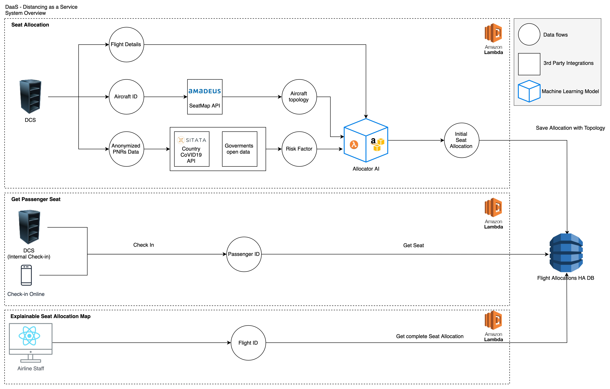

## Technical Overview



## API Docs (WIP)

You can check endpoints available for airlines and DPS in our [API documentation](https://brapifra.github.io/travelscrum-daas/).

## Run lambda function locally

```bash
yarn run-locally nameOfTheFunction # e.g. yarn run-locally createSeatAllocation
```
